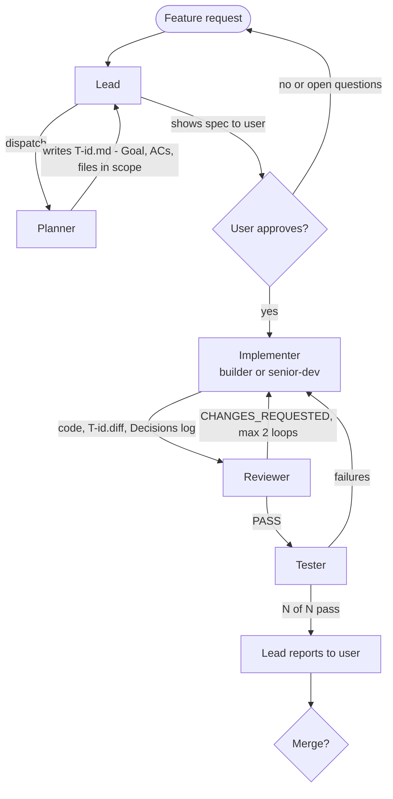
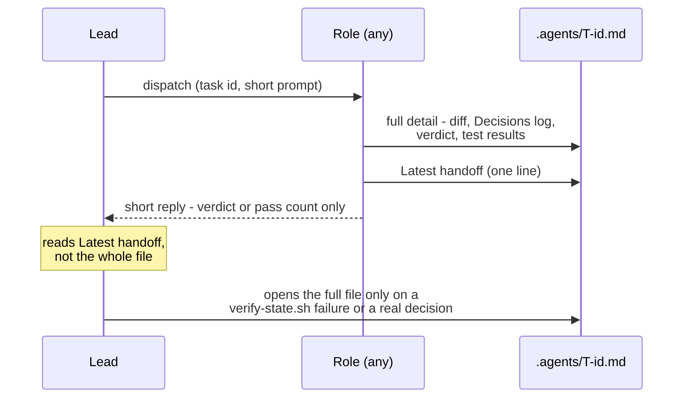
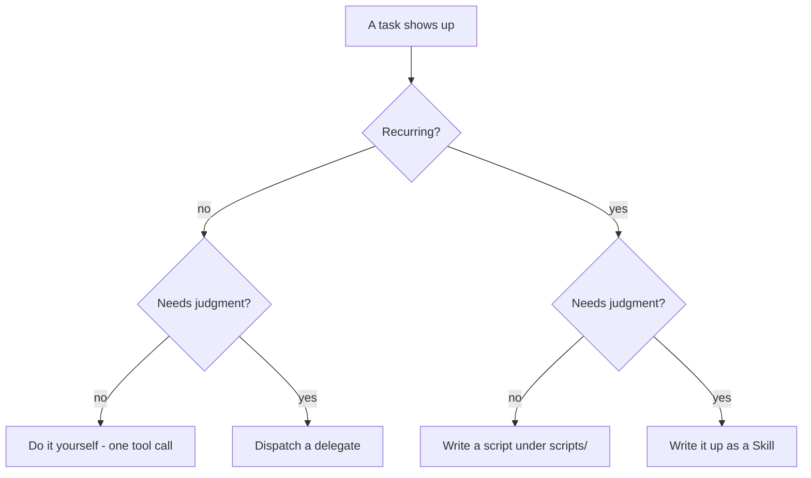

# agent-toolkit

A reusable version of the planner → implement → review → test multi-agent
pipeline: Claude subagents for planning/implementing, OpenCode (any vendor)
for cross-vendor implement/review/test, a state file
(`.agents/T-<id>.md`) as the single handoff surface between roles, and a
`delegate` skill so the lead's own context stays small across a long run. 

It grew out of a real project (a browser-extension repo) and was pulled out
here so the same setup — permissions, session-reuse policy, cross-vendor
independence rules, the state-file contract — doesn't get re-invented and
re-debugged from scratch in every new repo.

**Not a Claude Code user, or want a different tool to run the lead itself
(not just a worker role)?** Read `[SYSTEM.md](SYSTEM.md)` instead of this
file — one tool-agnostic page meant to be handed to any AI ("recreate this
system, with yourself as the lead"), pointing into `templates/` for detail
on demand rather than requiring everything read up front.

## How it flows




Every arrow into or out of a role is really a write to, or a read from,
`.agents/T-<id>.md` — see below.

### Context stays small, by construction




A role's chat reply is a receipt, not the record — the record is always the
file. That's what keeps the lead's own context flat whether the run has one
task or twenty: it never accumulates a second copy of every diff, verdict,
and test log it dispatched.

### Role permissions at a glance


| Role                                   | Reads                  | Writes                                      | Notes                                                   |
| -------------------------------------- | ---------------------- | ------------------------------------------- | ------------------------------------------------------- |
| Planner                                | whole repo             | `.agents/T-<id>.md` only                    | never touches source                                    |
| Implementer (`senior-dev` / `builder`) | whole repo             | source + `.agents/T-<id>.diff` + state file | the only roles that edit source                         |
| Reviewer                               | whole repo (read-only) | state file only, or nothing — see below     | blanket `edit`/`write: deny` by default in this toolkit |
| Tester                                 | whole repo (read-only) | `<test-dir>/**` + state file only           | never fixes, only reports                               |


The reviewer template ships **safer than it has to be** — blanket deny, not
scoped-allow on `.agents/**` — because a permission block that reads
correctly in YAML isn't proof it's enforced by the runtime. Loosen it only
after verifying that live against your own OpenCode server (see "Design
decisions" below).

## What's in it

```
bin/init.sh           the scaffolder — copies templates/ into a target repo
                        (--update: diffs current templates against a target
                        that's already scaffolded, writes nothing)
templates/             every generated file, with __PLACEHOLDER__ tokens
  claude/agents/        planner.md.tmpl, senior-dev.md.tmpl
  claude/commands/      feature.md.tmpl — the /feature pipeline command
  opencode/agent/        builder.md.tmpl, reviewer.md.tmpl, tester.md.tmpl
  agents-state/          TEMPLATE.md.tmpl — the T-<id> state file shape
  scripts/                oc.sh.tmpl (OpenCode CLI wrapper), team.sh.tmpl (tmux
                          layout — resumes the lead by default, --port for
                          running a second project at once, see docs/TEAM.md),
                          team-completion.bash.tmpl (optional shell completion
                          for team.sh), verify-state.sh.tmpl (deterministic
                          structural check — no LLM call), promote-findings.sh.tmpl
                          (copies tagged findings into project docs — no LLM
                          call, no agent write access to docs/)
skills/
  delegate/SKILL.md      context discipline for the lead — load this in
                          any project's lead session, independent of init.sh
  toolkit-init/SKILL.md  a thin skill wrapping bin/init.sh, so a lead can
                          run this conversationally in a target repo
  status-board/SKILL.md  keeps a top-level status board in sync with the
                          per-task state files — independent of init.sh
  karpathy-guidelines/    behavioral defaults (surface assumptions, minimum
    SKILL.md              code, surgical changes, verifiable success
                          criteria) — loaded by the lead via feature.md,
                          same as delegate. Not given to senior-dev/builder:
                          they'd need Skill-tool access to load it (a bigger
                          grant than either role needs), so the same content
                          is inlined directly into each of their own files
                          instead
  self-improvement/       optional, off by default — not loaded by
    SKILL.md               feature.md.tmpl like the others; see "Optional:
                          the self-improvement skill" for how to enable it
```


## Quick start

```bash
cd /path/to/some/other/project
opencode models          # see what's actually configured before picking models

~/PWS/agent-toolkit/bin/init.sh \
  --target . \
  --project-name "my-project" \
  --claude-model sonnet \
  --builder-model "vendor/model-a" \
  --reviewer-model "vendor/model-b" \
  --reviewer-fallback-model "vendor2/model-c" \
  --tester-model "vendor/model-a" \
  --test-dir e2e
```

```bash
# example

~/PWS/agent-toolkit/bin/init.sh \
  --target . \
  --project-name "my-project" \
  --claude-model sonnet \
  --builder-model "hcnsec/auto" \
  --reviewer-model "hcnsec/glm-5.3" \
  --reviewer-fallback-model sonnet \
  --tester-model "hcnsec/auto" \
  --test-dir e2e
```

`--reviewer-model` and `--reviewer-fallback-model` should be **different
model families** — the fallback is what the pipeline switches to when
`builder` implements and would otherwise share a vendor with the default
reviewer, which would defeat cross-vendor independence.

Cost/quality picks (Kimi implementer, GLM reviewer, DeepSeek Flash
tester, Claude Sonnet lead/planner/fallback), and why one OpenCode
aggregator plus Claude is better than a new toolkit tool per lab: see
`[docs/MODELS.md](docs/MODELS.md)`. The `hcnsec/auto` example above is
flag *shape* only — do not use `auto` for the reviewer.

`init.sh` never overwrites a file that already exists in the target — it
prints `skip (exists)` and leaves it alone, so re-running is safe and an
existing project's customizations survive.

`init.sh --update` (same flags) never writes anything either — it renders
the current templates into a temp file and diffs each one against what's
already in `--target`, so you can see what changed upstream since this
project was scaffolded and merge by hand (or hand the diff to your AI lead
to reconcile). Pass the same model/name flags used at the original init, or
every substituted line shows up as spurious diff noise.

## Using it

The pipeline is a slash command, not a separate program. Once scaffolded,
open Claude Code in the target repo and run:

```
/feature <describe the feature or bug you want fixed>
```

That runs the generated `.claude/commands/feature.md` — the lead reads it,
dispatches `planner` first, and walks the flow in "How it flows" above.
Two things need to be true first:

- `opencode serve` must be reachable — `scripts/team.sh` starts it in a
tmux layout (and resumes the lead's own conversation by default — see
[`docs/TEAM.md`](docs/TEAM.md) for that and for running a second project
at the same time), or run `opencode serve` yourself. `feature.md`'s own
Preflight step checks this (`curl -sS -m 5 http://localhost:4096`) and
tells you to start it if it isn't running.
- The target project needs its own `CLAUDE.md`/`AGENTS.md`. Every
generated role file defers project-specific constraints to it (see
"Design decisions" below) — without one, a role has nothing binding it
beyond this toolkit's generic rules.

Read `skills/toolkit-init/SKILL.md`'s "After it runs" checklist before
trusting the loop unattended, in particular the reviewer's permission
block — verify it's actually enforced against your real OpenCode server,
not just correct-looking YAML.

The first `/feature` run on a freshly-scaffolded project also asks, once,
whether to fill the generated role files' generic "what this codebase will
punish you for" sections with real specifics from your actual codebase —
gated by a `.agents/.needs-customization` marker that `init.sh` drops only
on a genuinely fresh scaffold, deleted the moment it's asked either way.
See `feature.md.tmpl`'s Preflight step 1.

## Design decisions, and why

- **Zero dependency, bash + sed only.** Matches the style of the project
this was extracted from, and means the scaffolder itself has nothing to
install or go stale.
- **Project-specific constraints are never duplicated into the templates.**
Every generated agent file says "read this project's own `CLAUDE.md` /
`AGENTS.md` first" rather than trying to guess or hardcode what a given
project cares about (security posture, banned patterns, style). The
toolkit owns the *process*; each project's own guidance file owns the
*content*.
- **The reviewer defaults to blanket-deny on edit/write.** A prior real run
found that a blanket "deny" configuration still let a reviewer write to a
file outside its intended scope — the enforcement didn't match the
config. `reviewer.md.tmpl` keeps the safe default and documents, inline,
exactly how to verify before loosening it (dispatch the agent, try to
make it edit a source file, confirm it's refused). Do not trust "the
reviewer can't touch source" without having run that check once against
your actual OpenCode server.
- **Session reuse (implement → review → test in one OpenCode session) is
documented as a real tradeoff, not a free win.** It saves reload cost but
feeds the reviewer the implementer's full read/edit trace, which can be
larger than the diff it's meant to review. Measure it before assuming
it's cheaper.
- **Each role's file is self-contained, one full copy per tool — not a
canonical file with thin per-tool shims.** `senior-dev` (Claude) and
`builder` (OpenCode) do the identical job for two different vendors, and
yes, their prose is duplicated by hand. A shared-file-plus-shim version was
tried and reverted: it meant an extra file open before a role could do
anything, made "can this role load a skill" depend on plumbing that turned
out to differ unpredictably per tool, and added structure for a
generalization (N tools per role) that, in practice, only ever had two
tools and one duplicated role. Two full files you can read start to finish
beat one indirection layer for a toolkit this size. The real cost of
duplication — a fix needing N edits — is real, but it's a one-time,
occasional cost each time behavior actually changes, not a permanent
runtime cost every dispatch pays. See `docs/ADDING-A-TOOL.md` for the
recipe to follow **at the point a role genuinely needs a second or third
tool** — extract to a shared file then, not preemptively.


## The `delegate` skill

Independent of `init.sh` — it's about the **lead's** own context, not the
pipeline's shape. Load it (`/delegate` or however skills are invoked in
your setup) at the start of any session that's going to dispatch several
subagents or shell out to `scripts/oc.sh` repeatedly. It covers: when a
dispatch is worth its overhead, why raw event streams are the biggest
avoidable context cost, named anti-patterns (circular delegation, context
loss across a handoff, silent scope creep, retrying into a collision)
drawn from real incidents in the project this was pulled out of, and a
four-way rule for simple tasks — one-off simple work you just do yourself,
simple work that recurs becomes a script, judgment that recurs becomes a
Skill, and only genuinely one-off judgment or cross-vendor work becomes a
delegate dispatch. `verify-state.sh` and `promote-findings.sh` exist
because that rule was applied to this toolkit's own pipeline.




[Read more about agent delegation rules here.](https://mcpmarket.com/tools/skills/claude-agent-delegation-rules)

## The `status-board` skill

Also independent of `init.sh`. A per-task state file stays current on its
own — each role updates it as it works — but nothing rolls that up into a
project-wide "what's the state of everything" view unless something forces
it to happen every time, not just when a task finishes. This skill is that
rule: update the top-level status board (one row per active task: id,
title, live `Status:`, which longer-term checklist item it maps to) at the
end of every pipeline step, and only check off a longer-term checklist box
once a task's `Status:` actually reaches its terminal "done" value, not
when review merely passes or implementation merely finishes. `feature.md`'s
step 5 points at it; load it explicitly for it to apply to every step, not
only the last one.

## Optional: the `self-improvement` skill (off by default)

Not loaded by anything in this toolkit automatically — `feature.md.tmpl`
does not reference it the way it does `delegate` and `karpathy-guidelines`.
That's deliberate: it edits the **lead's own instructions** in response to
something you say mid-session, and self-modifying prompts are a real risk
category worth an explicit opt-in, not a default.

What it does: watches for you correcting the lead's *orchestration* (not a
role's code — that's the reviewer's job) or confirming an unusual approach
worked, and writes the durable version of that lesson into `feature.md` or
the relevant role file — a sentence, not a rewrite — so a future run
doesn't need the same correction twice. It reuses *Findings for docs* +
`promote-findings.sh` for anything that's a project fact rather than a
pipeline-orchestration rule, instead of inventing a second memory
mechanism. Full behavior and guardrails: `skills/self-improvement/ SKILL.md`.

**To enable it in a project:**

1. Copy the file in:
  `cp ~/PWS/agent-toolkit/skills/self-improvement/SKILL.md .claude/skills/self-improvement/SKILL.md`
   (or wherever your tool discovers skills from — same as `delegate` and
   `karpathy-guidelines`, this toolkit's skills aren't rendered by
   `init.sh`, they're copied in on request).
2. Add one line to that project's own `.claude/commands/feature.md`, next
  to the existing `delegate`/`karpathy-guidelines` line: `If the  "self-improvement" skill is available, load it now.`
3. Read the guardrails in the skill file once before relying on it — it's
  scoped to be conservative (records constraints, never loosens them;
   asks rather than guesses; reports every edit it makes in the same
   turn), but it does write to your pipeline's own instruction files,
   which is a different risk than anything else in this toolkit.


## Adding a new tool, or moving a role to one

Not something `init.sh` does on its own for an untemplated tool — it's a
recipe, not a flag; `skills/toolkit-init/SKILL.md` branches to it when
asked for a tool with no `templates/<tool>/` directory yet. See
`[docs/ADDING-A-TOOL.md](docs/ADDING-A-TOOL.md)`: how to bring a role like
`tester` to a tool it doesn't run under yet, and — only once a role is
actually duplicated across 2+ tools, not before — how to collapse the
duplicated prose into one shared file so a future fix is one edit instead
of N. You can hand that file to an AI directly ("follow
docs/ADDING-A-TOOL.md to add `<tool>` support for `<role>`") and it has
enough to act on without re-deriving the pattern from scratch.

That recipe is for porting a *worker* role to a new tool. If you want a
*different AI to be the lead itself*, see `[SYSTEM.md](SYSTEM.md)` instead
— a single tool-agnostic file meant to be handed directly to that AI,
rather than something `init.sh` generates for it.

## Known gaps

- No automated test for `init.sh` beyond a manual smoke run into a scratch
directory (see the commit history / conversation this was built from). If
this toolkit grows real users, add a script under a future `test/` that
runs `init.sh` against a throwaway dir and asserts every placeholder was
substituted and no file was clobbered on a second run.
- Nothing here validates that a given OpenCode `vendor/model` string is
real — `opencode models` is the source of truth and isn't queried by
`init.sh` automatically.


## Other Skills

[https://github.com/anbturki/claude-toolkit](https://github.com/anbturki/claude-toolkit)