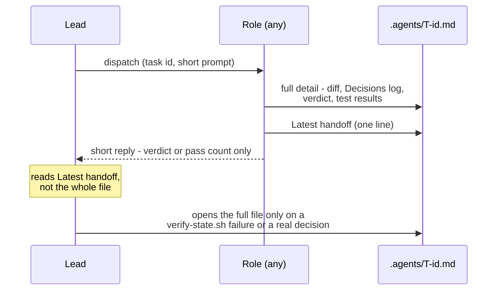
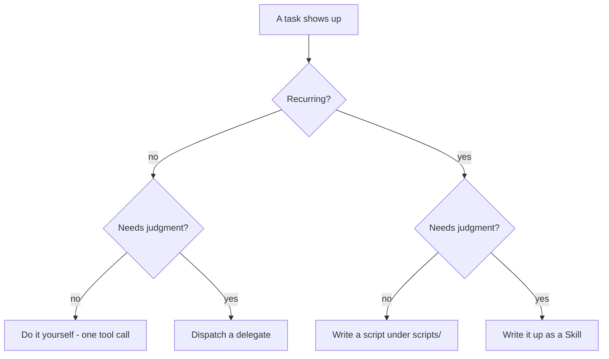

# agent-toolkit

A reusable version of the planner → implement → review → test multi-agent
pipeline: Claude subagents for planning/implementing, OpenCode (any vendor)
for cross-vendor implement/review/test, a state file
(`.agents/T-<id>.md`) as the single handoff surface between roles, and a
`delegate` skill so the lead's own context stays small across a long run. 

It grew out of a real project (a browser-extension repo) and was pulled out
here so the same setup — permissions, session-reuse policy, cross-vendor
independence rules, the state-file contract — doesn't get re-invented and
re-debugged from scratch in every new repo.

## How it flows


Every arrow into or out of a role is really a write to, or a read from,
`.agents/T-<id>.md` — see below.

### Context stays small, by construction



A role's chat reply is a receipt, not the record — the record is always the
file. That's what keeps the lead's own context flat whether the run has one
task or twenty: it never accumulates a second copy of every diff, verdict,
and test log it dispatched.

### Role permissions at a glance

| Role | Reads | Writes | Notes |
| --- | --- | --- | --- |
| Planner | whole repo | `.agents/T-<id>.md` only | never touches source |
| Implementer (`senior-dev` / `builder`) | whole repo | source + `.agents/T-<id>.diff` + state file | the only roles that edit source |
| Reviewer | whole repo (read-only) | state file only, or nothing — see below | blanket `edit`/`write: deny` by default in this toolkit |
| Tester | whole repo (read-only) | `<test-dir>/**` + state file only | never fixes, only reports |

The reviewer template ships **safer than it has to be** — blanket deny, not
scoped-allow on `.agents/**` — because a permission block that reads
correctly in YAML isn't proof it's enforced by the runtime. Loosen it only
after verifying that live against your own OpenCode server (see "Design
decisions" below).

## What's in it

```
bin/init.sh           the scaffolder — copies templates/ into a target repo
templates/             every generated file, with __PLACEHOLDER__ tokens
  claude/agents/        planner.md.tmpl, senior-dev.md.tmpl
  claude/commands/      feature.md.tmpl — the /feature pipeline command
  opencode/agent/        builder.md.tmpl, reviewer.md.tmpl, tester.md.tmpl
  agents-state/          TEMPLATE.md.tmpl — the T-<id> state file shape
  scripts/                oc.sh.tmpl (OpenCode CLI wrapper), team.sh.tmpl (tmux layout),
                          verify-state.sh.tmpl (deterministic structural check —
                          no LLM call), promote-findings.sh.tmpl (copies tagged
                          findings into project docs — no LLM call, no agent
                          write access to docs/)
skills/
  delegate/SKILL.md      context discipline for the lead — load this in
                          any project's lead session, independent of init.sh
  toolkit-init/SKILL.md  a thin skill wrapping bin/init.sh, so a lead can
                          run this conversationally in a target repo
  status-board/SKILL.md  keeps a top-level status board in sync with the
                          per-task state files — independent of init.sh
```


## Quick start

```bash
cd /path/to/some/other/project
opencode models          # see what's actually configured before picking models

~/PWS/agent-toolkit/bin/init.sh \
  --target . \
  --project-name "my-project" \
  --claude-model sonnet \
  --builder-model "vendor/model-a" \
  --reviewer-model "vendor/model-b" \
  --reviewer-fallback-model "vendor2/model-c" \
  --tester-model "vendor/model-a" \
  --test-dir e2e
```


```bash
# example

~/PWS/agent-toolkit/bin/init.sh \
  --target . \
  --project-name "my-project" \
  --claude-model sonnet \
  --builder-model "hcnsec/auto" \
  --reviewer-model "hcnsec/glm-5.3" \
  --reviewer-fallback-model sonnet \
  --tester-model "hcnsec/auto" \
  --test-dir e2e
```

`--reviewer-model` and `--reviewer-fallback-model` should be **different
model families** — the fallback is what the pipeline switches to when
`builder` implements and would otherwise share a vendor with the default
reviewer, which would defeat cross-vendor independence.

`init.sh` never overwrites a file that already exists in the target — it
prints `skip (exists)` and leaves it alone, so re-running is safe and an
existing project's customizations survive.

## Design decisions, and why

- **Zero dependency, bash + sed only.** Matches the style of the project
this was extracted from, and means the scaffolder itself has nothing to
install or go stale.
- **Project-specific constraints are never duplicated into the templates.**
Every generated agent file says "read this project's own `CLAUDE.md` /
`AGENTS.md` first" rather than trying to guess or hardcode what a given
project cares about (security posture, banned patterns, style). The
toolkit owns the *process*; each project's own guidance file owns the
*content*.
- **The reviewer defaults to blanket-deny on edit/write.** A prior real run
found that a blanket "deny" configuration still let a reviewer write to a
file outside its intended scope — the enforcement didn't match the
config. `reviewer.md.tmpl` keeps the safe default and documents, inline,
exactly how to verify before loosening it (dispatch the agent, try to
make it edit a source file, confirm it's refused). Do not trust "the
reviewer can't touch source" without having run that check once against
your actual OpenCode server.
- **Session reuse (implement → review → test in one OpenCode session) is
documented as a real tradeoff, not a free win.** It saves reload cost but
feeds the reviewer the implementer's full read/edit trace, which can be
larger than the diff it's meant to review. Measure it before assuming
it's cheaper.


## The `delegate` skill

Independent of `init.sh` — it's about the **lead's** own context, not the
pipeline's shape. Load it (`/delegate` or however skills are invoked in
your setup) at the start of any session that's going to dispatch several
subagents or shell out to `scripts/oc.sh` repeatedly. It covers: when a
dispatch is worth its overhead, why raw event streams are the biggest
avoidable context cost, named anti-patterns (circular delegation, context
loss across a handoff, silent scope creep, retrying into a collision)
drawn from real incidents in the project this was pulled out of, and a
four-way rule for simple tasks — one-off simple work you just do yourself,
simple work that recurs becomes a script, judgment that recurs becomes a
Skill, and only genuinely one-off judgment or cross-vendor work becomes a
delegate dispatch. `verify-state.sh` and `promote-findings.sh` exist
because that rule was applied to this toolkit's own pipeline.



[Read more about agent delegation rules here.](https://mcpmarket.com/tools/skills/claude-agent-delegation-rules)

## The `status-board` skill

Also independent of `init.sh`. A per-task state file stays current on its
own — each role updates it as it works — but nothing rolls that up into a
project-wide "what's the state of everything" view unless something forces
it to happen every time, not just when a task finishes. This skill is that
rule: update the top-level status board (one row per active task: id,
title, live `Status:`, which longer-term checklist item it maps to) at the
end of every pipeline step, and only check off a longer-term checklist box
once a task's `Status:` actually reaches its terminal "done" value, not
when review merely passes or implementation merely finishes. `feature.md`'s
step 5 points at it; load it explicitly for it to apply to every step, not
only the last one.

## Known gaps

- No automated test for `init.sh` beyond a manual smoke run into a scratch
directory (see the commit history / conversation this was built from). If
this toolkit grows real users, add a script under a future `test/` that
runs `init.sh` against a throwaway dir and asserts every placeholder was
substituted and no file was clobbered on a second run.
- Nothing here validates that a given OpenCode `vendor/model` string is
real — `opencode models` is the source of truth and isn't queried by
`init.sh` automatically.

